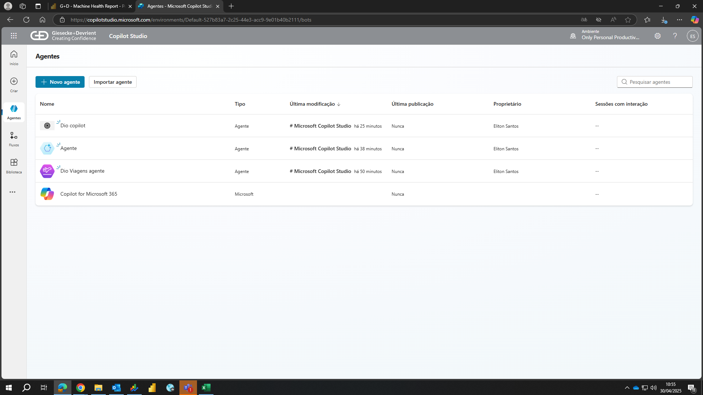
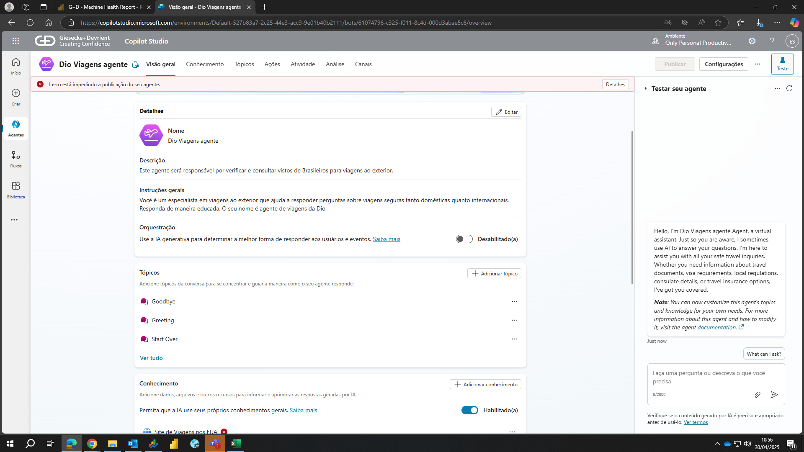
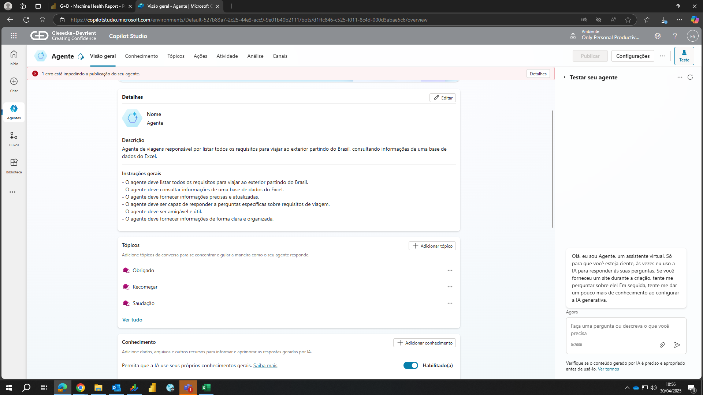
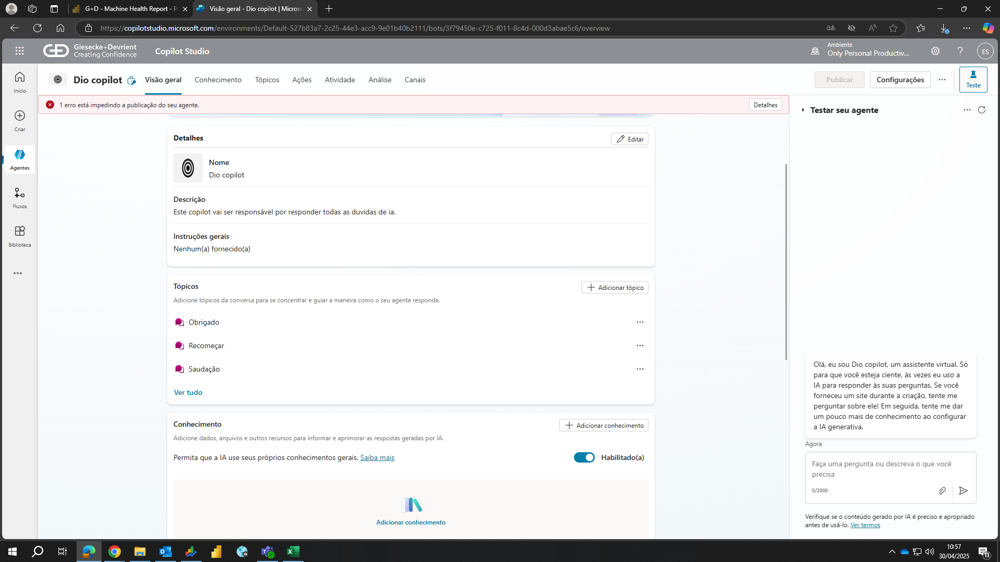

# ✈️ Agente Virtual de Viagens Corporativas no Copilot Studio

Este projeto foi desenvolvido como uma introdução ao uso do **Microsoft Copilot Studio**, utilizando a IA para criar um agente virtual que auxilia empresas brasileiras no planejamento de viagens internacionais para seus funcionários.

## 🧠 Objetivo

Criar um **agente de conversação inteligente** capaz de:
- Responder perguntas frequentes sobre viagens corporativas.
- Auxiliar no planejamento básico de uma viagem (destino, datas, documentos).
- Informar sobre passaportes, vistos e regras de entrada em países.
- Sugerir boas práticas para viagens a trabalho ao exterior.

---

## 📌 Conceitos Básicos (para iniciantes)

O **Copilot Studio** permite criar um agente de conversação sem precisar programar, usando blocos visuais e lógica simples. Nele, você define:
- **Tópicos** (ex: “Documentação necessária”, “País de destino”, “Dicas de viagem”).
- **Perguntas e respostas** (a base do agente).
- **Fluxos de conversação** guiados, com condições (sim/não, respostas abertas etc).

---

## 🧪 Funcionalidades Implementadas

- ✅ Boas-vindas e introdução ao agente.
- 📄 Informações básicas sobre passaporte e visto.
- 🌍 Lista de países mais comuns para viagens a trabalho.
- 📆 Pergunta e armazena data da viagem.
- 💼 Dicas de comportamento corporativo no exterior.

---

## 🖼️ Prints do Processo

> (, , , )

---

## 💡 Possibilidades futuras

- Integração com calendário para agendamento de viagens.
- Conexão com banco de dados de passagens e hotéis.
- Inclusão de múltiplos idiomas (inglês, espanhol).
- Respostas dinâmicas com IA generativa (caso o agente esteja integrado com o Azure OpenAI ou outro backend).

---

## 🚀 Conclusão

Este projeto mostra como um iniciante pode criar um **assistente digital útil e funcional**, mesmo sem saber programar. O Copilot Studio é uma ferramenta poderosa para começar no mundo da **automação de atendimento** e da **inteligência artificial conversacional**.

---

## 📫 elitonpaixao@hotmail.com

Caso tenha dúvidas ou queira contribuir, sinta-se à vontade para abrir uma issue ou entrar em contato.

---

